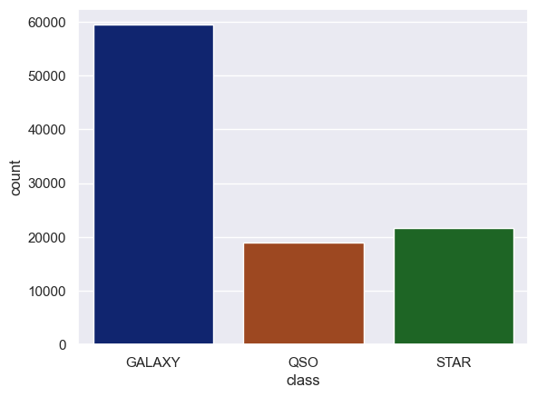
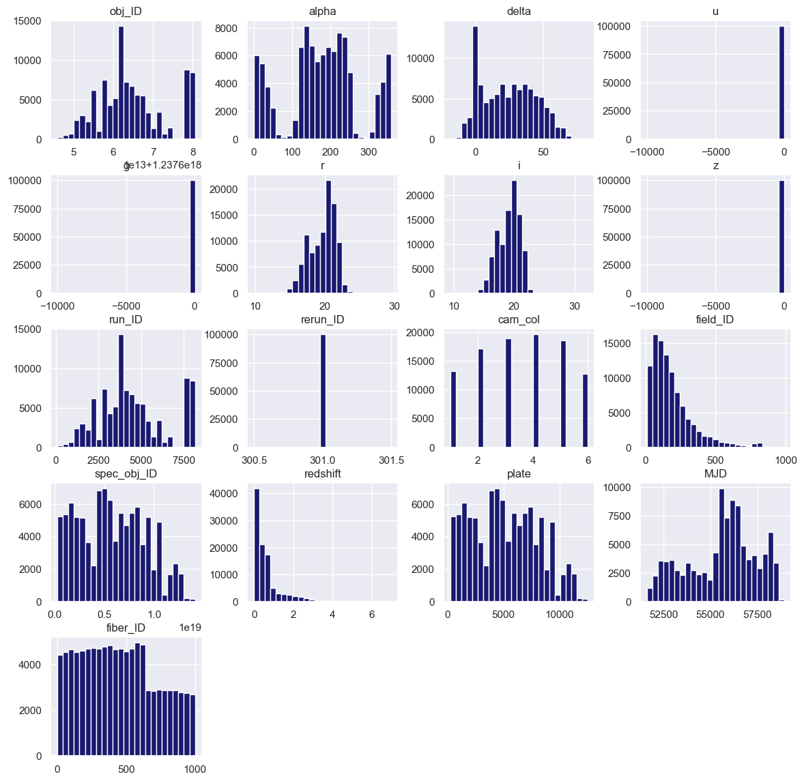
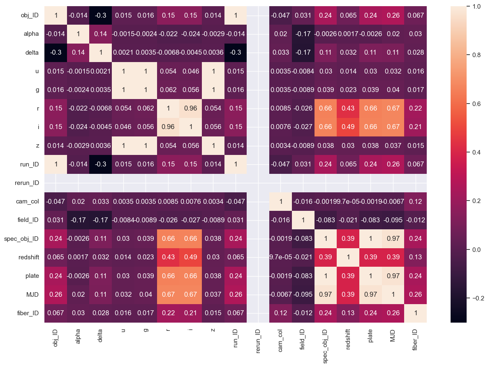
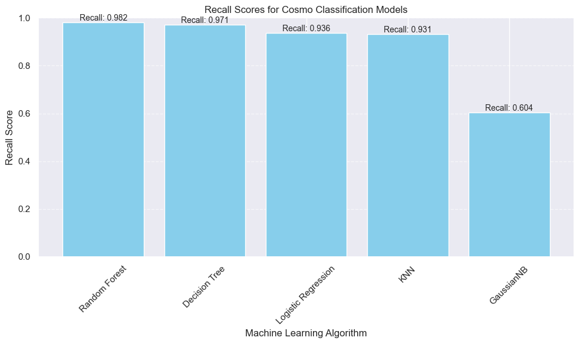

# 🚀 Cosmo Classify Project 🌌

Welcome to the **Cosmo Classify** project, an exciting journey through the cosmos using the power of machine learning! Join us on this interstellar adventure where we explore and classify celestial wonders.

🌟 **Vision:** My mission is to unlock the mysteries of the universe by categorizing and understanding celestial objects using advanced machine learning techniques.

## 🪐 **Project Name:** 
**Cosmo**: This name draws inspiration from the vibrant "cosmos," signifying the vastness of the universe. It underscores the all-encompassing scope of my project, which involves the exploration and study of celestial phenomena, including stars, galaxies, and other cosmic entities.

**Classify**: This part of the name highlights my core objective: organizing, categorizing, and making sense of the extensive data collected by the James Webb Space Telescope. Machine learning algorithms are my guiding stars in this cosmic endeavor, aiding in the classification and identification of diverse celestial objects.

## 1. Abstract
In a historic achievement, space agencies like the European Space Agency and NASA have conquered one of the cosmos's most daunting challenges: the successful launch and orbital placement of the awe-inspiring [James Webb Space Telescope](https://www.jwst.nasa.gov/). As we stand on the precipice of a groundbreaking era in space exploration, this marvel of technology is poised to unveil the universe's secrets in unparalleled detail.

With the James Webb Space Telescope gracefully positioned in its designated orbit, it's only a matter of months before this cutting-edge observatory becomes fully operational. In the not-so-distant future, Earth will be bathed in a breathtaking deluge of celestial images captured from the deepest reaches of the cosmos. Prepare to embark on an extraordinary journey as this remarkable telescope opens a window to the vast expanse of the universe, revealing previously unseen stars, galaxies, and enigmatic quasars.

However, with this treasure trove of data comes an immense challenge: the need to make sense of it all. The cosmos is about to unleash an overwhelming influx of new space objects that demand classification and understanding. To tackle this cosmic conundrum, the inevitable solution lies in the realm of machine learning.

🌐 **Learn More:** Dive deeper into the [James Webb Space Telescope](https://en.wikipedia.org/wiki/James_Webb_Space_Telescope) and the wonders of the [cosmos](https://en.wikipedia.org/wiki/Cosmos).

## 2. Dataset
For our cosmic voyage, I've secured a dataset from the Kaggle database system 🌐 [Link to Dataset](https://www.kaggle.com/datasets/fedesoriano/stellar-classification-dataset-sdss17), originally published by the Sloan Digital Sky Survey. This data treasure trove was gathered using a ground telescope in New Mexico, USA. My dataset boasts a substantial one hundred thousand data points, making it a valuable compass for navigating the cosmos.

In essence, my project, known as **"Cosmoclassify,"** is poised to harness the power of machine learning algorithms to classify and gain profound insights into the enigmatic celestial objects that populate the universe.

## 🌟 Main Purpose
The **Cosmo Classify Project** sets its sights on the following cosmic objectives:

🔭 **Explore the Cosmos:** We'll voyage through a dataset teeming with cosmic information.

🌐 **Prepare for the Journey:** My data preprocessing phase will encode categorical variables and address the cosmic class imbalance.

🪐 **Cosmic Classification:** Various machine learning models will be my guiding stars, helping us classify celestial objects based on their cosmic properties.

📊 **Cosmic Scorecard:** I'll assess my models' performance using the recall score, a cosmic metric that measures their ability to accurately classify each celestial class.

🛰️ **Future Cosmic Exploration:** My project provides a structured and modular codebase for future cosmic enhancements and model comparisons.

## 🛸 Project Structure
My cosmic voyage is structured into different celestial sections, each with its unique cosmic purpose:

### Data Exploration 👀

In this cosmic sector, I delve deep into my dataset, striving to understand its cosmic intricacies. I'll create a cosmic visual tapestry, including:

- Countplots to visualize the distribution of celestial classes.

- Histograms to decode the cosmic distribution of numerical features.

- Heatmaps to uncover cosmic correlations between variables.

### Data Encoding 🌠

In this cosmic phase, I'll encode categorical variables, preparing the cosmic data for my machine learning models. Ensuring my models can traverse the cosmic data effectively.

### Data Resampling 🪐

To address the cosmic class imbalance, I'll deploy the Synthetic Minority Over-sampling Technique (SMOTE). This cosmic technique balances the cosmic dataset, ensuring my models don't favor the cosmic majority.

### Model Training 🤖

My cosmic fleet of machine learning models includes:

- Logistic Regression
- K Nearest Neighbors
- Decision Tree
- Gaussian Naive Bayes
- Random Forest

These models will be my cosmic companions as I navigate the dataset.

### Model Evaluation 📈

In this cosmic stage, I evaluate my models' performance using the recall score, a cosmic metric that measures their ability to accurately classify each celestial class. The higher the recall, the brighter my cosmic success.

Embark with me on this cosmic odyssey as we unravel the universe's mysteries, one data point at a time.

### Project Update in Progress 🚧

Hey there! This project is currently under active development and improvements are on the way. 🚀✨

As I continue my journey into the fascinating world of machine learning and deep learning, stay tuned for exciting updates and incredible enhancements. You can expect to see some awesome cosmic discoveries! 🌟😄

Thanks for your patience, and get ready for some cosmic surprises! 🌌🛸

🚀 **Ready to Join My Cosmic Voyage?** [Let's Begin](CosmoClassify.py)
